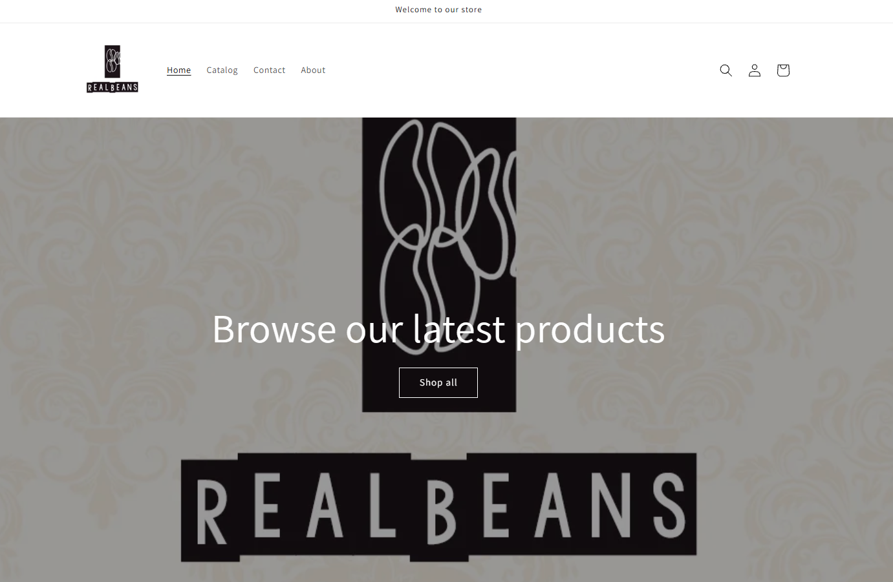
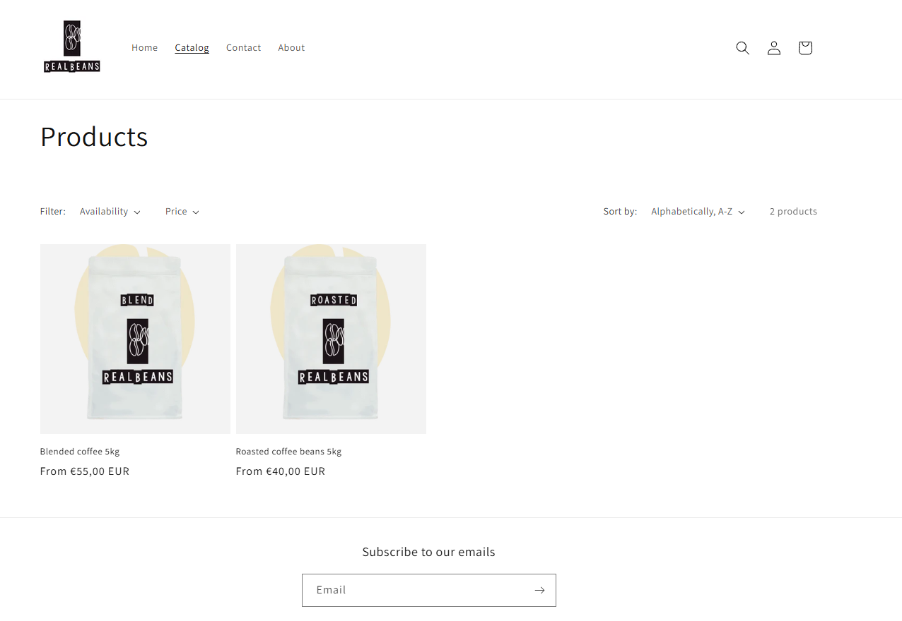
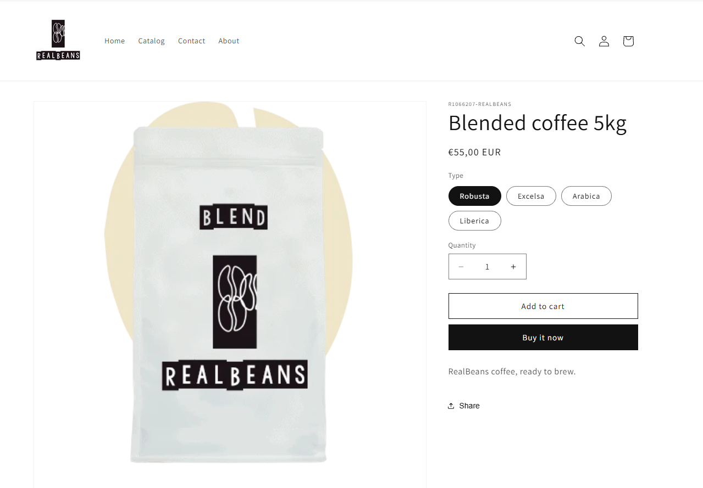
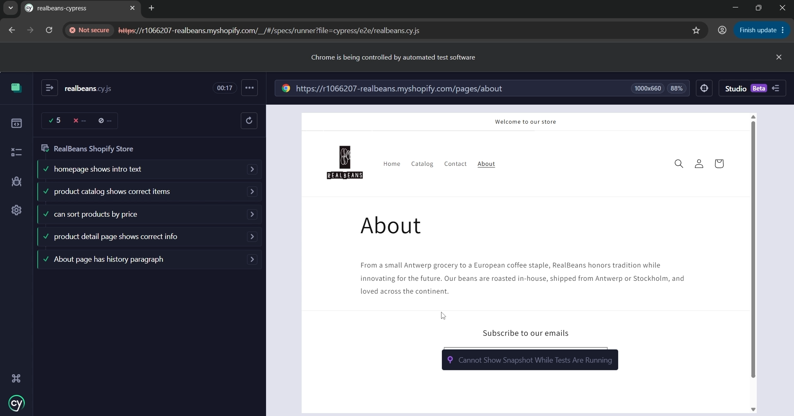
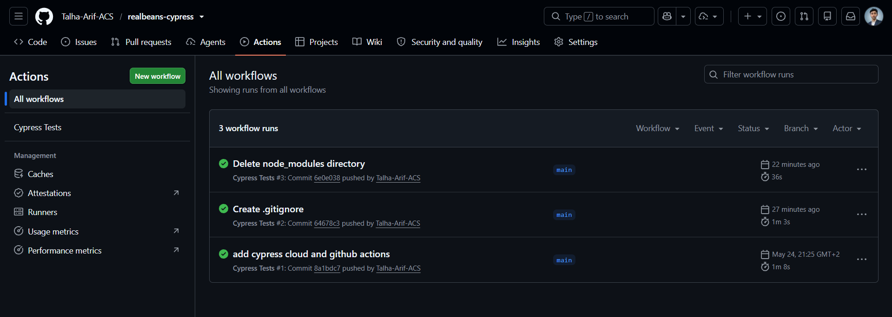
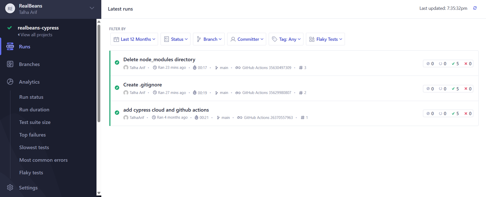
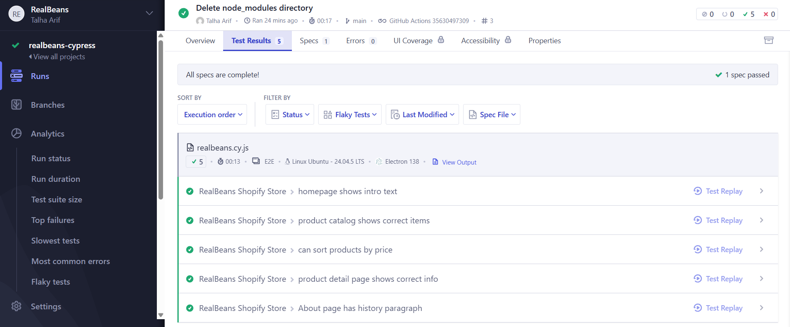

# RealBeans: Shopify Store & Cypress E2E Testing

[](https://github.com/Talha-Arif-ACS/realbeans-cypress/actions)

A Shopify webshop for a fictional coffee roaster, covered by automated end-to-end tests written in Cypress. The tests run on every push through GitHub Actions and the results are recorded in Cypress Cloud.



## Overview

RealBeans is a coffee brand that sells roasted and blended coffee beans in 5 kg bulk sizes. The webshop was built on Shopify, and this repository contains the test suite that verifies it from a visitor's point of view: does the homepage load, are the right products listed, can they be sorted, and do the product and About pages show the correct content.

The project combines two parts:

1. **The Shopify store**: the storefront, product catalogue and content pages.
2. **The test automation**: a Cypress suite, a CI pipeline and a test dashboard.

## Features

- Shopify storefront with Home, Catalog, Contact and About pages
- Product catalogue with sorting by price
- Individual product pages with descriptions
- 5 automated end-to-end tests covering the main visitor flows
- Continuous integration: tests run automatically on every push
- Test results and history recorded in Cypress Cloud

## Technologies

| Area | Tools |
|---|---|
| E-commerce | Shopify |
| Test framework | Cypress (JavaScript) |
| CI/CD | GitHub Actions |
| Test reporting | Cypress Cloud |

## Shopify Implementation


*The product catalog page, listing the store's coffee bean products with sorting support.*


*An individual product page showing the product name, description and price.*

## What Is Tested

All tests live in [`cypress/e2e/realbeans.cy.js`](cypress/e2e/realbeans.cy.js) under the suite **RealBeans Shopify Store**.

| # | Test | What it verifies |
|---|---|---|
| 1 | Homepage shows intro text | The homepage loads and displays the brand's introduction |
| 2 | Product catalog shows correct items | `/collections/all` lists *Roasted coffee beans 5kg* and *Blended coffee 5kg* |
| 3 | Can sort products by price | Selecting *price ascending* in the sort dropdown updates the URL with `sort_by=price-ascending` |
| 4 | Product detail page shows correct info | The roasted coffee beans product page shows the correct title and description |
| 5 | About page has history paragraph | The About page displays the company history text |

Because the development store is password protected, each test starts with a check for the Shopify password page and unlocks the store when it appears. The password is passed in through an environment variable, never hardcoded in the test file (see [Installation & Setup](#installation--setup)).


*The interactive Cypress runner, with all 5 tests passing locally.*

## CI/CD Pipeline

```
Push to GitHub
      ↓
GitHub Actions workflow ("Cypress Tests")
      ↓
Cypress runs the E2E suite on Ubuntu
      ↓
Results recorded in Cypress Cloud
```

The workflow is defined in [`.github/workflows`](.github/workflows). It checks out the code, installs dependencies, runs the Cypress tests and uploads the results to Cypress Cloud. The Cypress Cloud record key and the store password are stored as GitHub repository secrets and are never committed to the code.


*A GitHub Actions run triggered by a push, showing the Cypress Tests workflow completing successfully.*


*The run history in Cypress Cloud, where every CI run is recorded for review.*


*Detail view of a passing run in Cypress Cloud, showing all 5 tests green.*

## Project Structure

```
.
├── .github/
│   └── workflows/        # GitHub Actions workflow that runs the tests
├── cypress/
│   ├── e2e/              # Test specifications (realbeans.cy.js)
│   ├── fixtures/         # Cypress test data folder (not used by the current tests)
│   └── support/          # Cypress support files
├── docs/
│   └── screenshots/      # Images used in this README
├── cypress.config.js     # Cypress configuration (project ID)
├── package.json          # Dependencies and scripts
└── package-lock.json     # Locked dependency versions
```

## Installation & Setup

**Prerequisites:** [Node.js](https://nodejs.org/) (LTS) and Git.

```bash
git clone https://github.com/Talha-Arif-ACS/realbeans-cypress.git
cd realbeans-cypress
npm install
```

The tests need the Shopify store password. Create a file named `cypress.env.json` in the project root (it is listed in `.gitignore`, so it is never committed):

```json
{
  "STORE_PASSWORD": "your-store-password"
}
```

## Usage

Open the interactive Cypress runner:

```bash
npx cypress open
```

Choose **E2E Testing**, pick a browser and click `realbeans.cy.js`.

Or run everything headlessly in the terminal:

```bash
npx cypress run
```

## What I Learned

This project taught me how to test a real, hosted web application end to end: selecting elements reliably, handling a password-protected storefront, and verifying content and behaviour like sorting through the URL. It also gave me hands-on experience with a full CI setup, where GitHub Actions runs the suite automatically and Cypress Cloud keeps a history of the results — including debugging a failing pipeline caused by a stale credential after rotating the store password.
